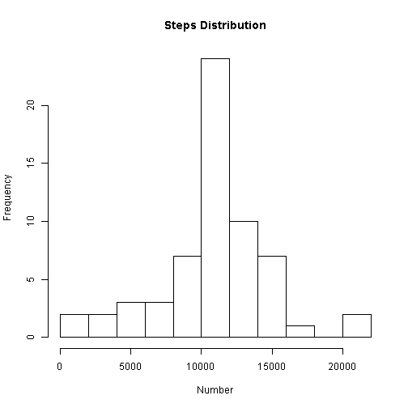

#Investigate number of steps each five minutes through the day
##Read the raw data. 
Ignore missing data at the moment

```r
setwd("C:/Coursera/ReproduceResearch/Assign1/Data")
#Source: https://d396qusza40orc.cloudfront.net/repdata%2Fdata%2Factivity.zip
data <- read.csv("activity.csv")
```
##Histogram of steps per interval summed over days

```r
data$date<- as.Date(strptime(data$date, format="%Y-%m-%d"))
sumDays <- aggregate(data$steps, by=list(c(data$date)),FUN=sum,na.rm=TRUE)
colnames(sumDays) <- c("day","steps")
hist(sumDays$steps,breaks=12,xlab="Number",main="Steps Distribution")
```

 

*Mean and median number of steps*

```r
mean(sumDays$steps)
```

```
## [1] 9354.23
```

```r
median(sumDays$steps)
```

```
## [1] 10395
```
##Average steps in each 5 minute interval

```r
meanInts <- aggregate(data$steps, by=list(c(data$interval)),FUN=mean, na.rm=T)
colnames(meanInts) <- c("interval","steps")

plot(meanInts$steps,type="l", xaxt = "n",
     ylab = "Steps", xlab = "Time of day",
     main = "Average steps each 5 minutes")
labels <- seq(0,24,6) 
labels.at <- seq(0,24*12,6*12)    #seq(0,2400,1200)
axis(side=1, at=labels.at, labels = labels)
```

 

```r
#Which interval has the most steps. Convert to time of day
maxInt <- which(meanInts$steps==max(meanInts$steps),) 
meanInts[maxInt,1]/100
```

```
## [1] 8.35
```
###Count missing values and replace with the mean value

```r
#Missing intervals
sum(is.na(data$steps))
```

```
## [1] 2304
```

```r
#Missing days
sum(is.na(sumDays$steps))
```

```
## [1] 0
```

```r
#substitue NA with mean value.
meanStepsInt <- round(mean(data$steps,na.rm=T))
data$steps[is.na(data$steps)] <- meanStepsInt
```
###Re-draw the histogram

```r
sumDays <- aggregate(data$steps, by=list(c(data$date)),FUN=sum,na.rm=TRUE)
colnames(sumDays) <- c("day","steps")
hist(sumDays$steps,breaks=12,xlab="Number",main="Steps Distribution")
```

 

```r
###Recalculate mean and median number of steps
mean(sumDays$steps)
```

```
## [1] 10751.74
```

```r
median(sumDays$steps)
```

```
## [1] 10656
```
*The mean has increased because some observations have been increased
by replacing mssing values with the mean value.
The median has increased a little because days with few steps have gained
more than days with many steps*

##Show separate stats for weekdays and weekends
*Create a factor column for weekend and weekday*

```r
wkend <- weekdays(data$date,abbreviate=T) %in% c("Sat","Sun")
data$dayType[wkend] <- "Weekend"
data$dayType[!wkend] <- "Weekday"
#sum over days, weekday and weekend separately
dataSum <- aggregate(data$steps, by=list(data$interval,data$dayType),FUN=mean)
colnames(dataSum) <- c("interval","dayType","steps")
```
##Compare the weekend and weekday steps separately

```r
library(lattice)
xyplot(
  steps ~ interval/12 | dayType
  , data=dataSum
  , layout=c(1,2)
  , main="Average Steps ~ 5 min. interval"
  , xlab="5 Minute interval ID"
  , ylab="Average Steps Taken"
  , type=c("l","l")
)
```

 

*There is slightly more activity in the morning around 8.30 on weekdays.
The rest of the day has less activity than at a weekend.*
